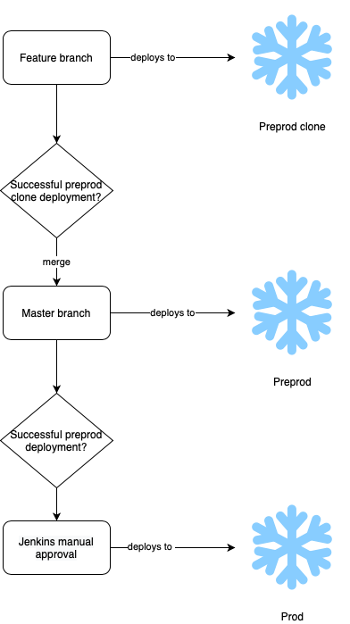

# aspire-snowflake-deployment-finance-nectarine

Please read the README fully before use of this template.
This repo is a template repo for starting IRM specific snowflake deployment;
moving away from all DDL being deployed in [aspire-snowflake-deployment-adw](https://github.com/JSainsburyPLC/aspire-snowflake-deployment-adw).

** Only staging and presentation layer components for each respective IRM should be deployed this way.**
RDV and BDV changes should still be deployed via [aspire-snowflake-deployment-adw](https://github.com/JSainsburyPLC/aspire-snowflake-deployment-adw)
This is because there are potential dependencies between RDV and BDV objects between IRM, therefore best to keep their deployment together.

This deployment method uses a Jenkins file that points to a Jenkins shared library on the [Nonprod Jenkins](https://jenkins.grada-ss-nonprod.js-devops.co.uk) and [Prod Jenkins](https://jenkins.grada-ss-prod.js-devops.co.uk) accounts.
The Jenkins shared library contains all the scripts for deploying DDL changes to Snowflake.
The code for this is found here: [aspire-snowflake-deployment-common](https://github.com/JSainsburyPLC/aspire-snowflake-deployment-common)

# Deployment Process
All DDL changes for a single IRM should be contained within a git repository named `aspire-snowflake-deployment-<data-domain>`,
and have a project on Jenkins. This naming convention is important.



Testing of deployment can be done via branches; feature branches deploy changes to a PREPROD database clone,
in which changes can be tested.
Deployment to PROD and PREPROD happens from a **single** github master/main branch,
DDL changes are deployed to PREPROD from Nonprod Jenkins and then deployed to PROD **after** manual approval in Prod Jenkins.


# IRM specific deployment repo setup

Repo structure is as follows:
```
.
├── update
|    └── schema-a
|           └── create_IRM_schema.sql
|           └── tables
|                   └── create_table_a.sql
|           └── views 
|                   └── create_view_a.sql
├── post-deploy
├── pre-deploy
├── Jenkinsfile
└── changelog.xml
```

1) Set up new repo; this repo can be used as a template, when naming your new IRM specific repo please use the naming
    convention `aspire-snowflake-deployment-<data-domain>`, otherwise deployment may not work.
    If other squads work within the same IRM communicate the existence of the new repo for DDL deployment.
2) Adjust your Jenkinsfile to set the name of your clone. See [Example Jenkins File section](#example-jenkins-file) for details.
3) Add Sainsburys-pii user as an outside collaborator to your repo - read access is sufficient.
   You will need an owner of the Sainsburys-pii user to accept the invitation to collaborate to your repo (post in 
   the Slack channel [#github](https://sainsburys-tech.slack.com/archives/CPS9CHJLW)).
   The invitation expires if not accepted after awhile, so it's best to find an owner who can accept the invitation
   shortly after sending.
4) Add rules to your repo to ensure that at least two approvers are required before merging to the master/main branch.
5) Set your project up in Non Prod Jenkins. The easiest way to do this is through copying pipelines that already exist. Note the naming conventions.
    SSH cloning of the repo is required and the Sainsburys-pii GitHub user credentials are used to authenticate this.
    - Create new **feature branch deployment pipeline**:
        - Create a new item (left hand side panel) and use the naming convention: `Aspire_ADW_Deployment_<IRM>_Feature_Branches`.
          You can specify a pipeline you want to copy from in this page.
        - You can copy other IRM specific feature branch deployment pipelines, i.e. `Aspire_ADW_Deployment_Agriculture_Feature_Branches`.
        - Under "Branch Sources", change the "Project Repository" URL to your repo.
        - Ensure you click "Save" AND "Apply" to save your changes.
    - Test **feature branch deployment pipeline**:
        - Create a new branch from master with the naming convention: `feature/<JIRAticketnumber>`. 
        - With no changes in the changelog this should be picked up in Jenkins and the pipeline should start building.
    - Create a new **master/main deployment pipeline**:
        - Create a new item and use the naming convention `Aspire_ADW_Deployment_<IRM>`.
          You can specify a pipeline you want to copy from in this page.
        - You can copy other IRM specific feature branch deployment pipelines, i.e. `Aspire_ADW_Deployment_Agriculture`.
        - In the "General" tab, change the "Project url" to your repo URL.
        - In the "Advanced Project Options" tab (or scroll further down), change the "Repository URL" to your repo URL.
        - For the "Branch Specifier" - ensure this aligns with your repo's master/main branch. `*/main` or `*/master` 
        - Ensure you click "Save" AND "Apply" to save your changes.
    - Test **master/main deployment pipeline**:
        - Run the project manually (select 'Build Now' in the project options).
        - Check console output references your repo. The console output for a build can be found by clicking the build number `#x` 
          and the console output (left hand side panel).
        - Note that the manual deployment step is needed first but following this future commits should then deploy automatically
6) Set your project up in Prod Jenkins. You may not have the right permissions to create or configure items in Prod Jenkins. 
   If you can't, ask in the [#data-jenkins-admin](https://sainsburys-tech.slack.com/archives/C01HL2CUWCX) Slack channel
   to either grant you or someone in your team to be a Jenkins Admin, or an existing Jenkins admin can create one for you. 
   
    If you have the permissions to create/configure items, you can set up your pipeline in a similar way to Non Prod, 
   by copying pipelines that already exist. Note the naming conventions.
    SSH cloning of the repo is required and the Sainsburys-pii GitHub user credentials are used to authenticate this.
    - Create a new deployment pipeline:
        - Create a new item and use the naming convention `Aspire_ADW_Deployment_<IRM>`.
          You can specify a pipeline you want to copy from in this page.
        - You can copy other IRM specific branch deployment pipelines, i.e. `Aspire_ADW_Deployment_Agriculture`. 
        - As with the Non Prod master/main deployment pipeline, you will need to change two URLs and check the
          "Branch Specifier" aligns with your repo's master/main branch.
          
7) Update the [aspire-snowflake-deployment-adw](https://github.com/JSainsburyPLC/aspire-snowflake-deployment-adw) repo README with a link to your new deployment repo.
8) Remove the example pre and post deploy scripts and you're now ready to deploy your own DDL.
    See [Testing deployment and deploying to PREPROD](#testing-deployment-and-deploying-to-preprod) on how to get started.

## Example Jenkins File:
```
@Library('aspire-snowflake-deployment-common@v1.6')_
callPipeline('<database_clone_name>')
```
Please amend the Jenkinsfile to the latest version in your repo when using this template.

Feature branches use a cloned version of the `ADW_PREPROD` database and named `ADW_PREPROD_CLONE_<database_clone_name>`,
clone names should be in a format accepted by Snowflake (i.e. no dashes).
If the clone doesn't already exist, it will be created automatically - reusing a squad named clone is preferred.
Refreshing or dropping an unused clone can be done with custom pre-deploy SQL scripts.
See [Pre-deploy and post-deploy scripts](#pre-deploy-and-post-deploy-scripts) for details.  

## Testing deployment and deploying to PREPROD
1) Create a feature branch from master with the naming convention `feature/<JIRAticketnumber>`.
    This naming convention is how Jenkins identifies multibranch deployments to make, without this you can't test deployment in the clone database.
2) Add a suitable clone name to the Jenkinsfile, e.g. 'strawberry'.
3) Add all DDL changes to a new file in the respective folder created for each schema under the `/update` folder.
    Example: `aspire-snowflake-deployment-<business_domain>/update/adw_<business_domain>_pl/adw_<business_domain>_pl_<ERwin_version>.ddl.`
   ```
    aspire-snowflake-deployment-<business_domain>
    ├── update
    |    └── adw_<business_domain>_pl
    |           └── create_IRM_schema.ddl
    |           └── adw_<business_domain>_pl_<ERwin_version>.ddl
    ```
   It is up to you and your team how you want to organise DDL scripts within the schema folders. 
4) Modify the `changelog.xml` file to add an changeSet entry for the newly added .ddl script.
    Example:
    ```XML
    <?xml version="1.0" encoding="UTF-8"?>
    
    <databaseChangeLog
      xmlns="http://www.liquibase.org/xml/ns/dbchangelog"
      xmlns:xsi="http://www.w3.org/2001/XMLSchema-instance"
      xsi:schemaLocation="http://www.liquibase.org/xml/ns/dbchangelog
             http://www.liquibase.org/xml/ns/dbchangelog/dbchangelog-3.1.xsd">
        <changeSet id="nnn" author="Strawberry-Squad">
            <sqlFile path="update/adw_<business_domain>_pl/adw_<business_domain>_pl_<ERwin_version>.ddl"/>
        <changeSet>
    </databaseChangeLog>
    ```
    `nnn` - is the sequence number. 
    You will need to change the `changeSet id`, `author`, and the `sqlFile path`.
   
    The combination of `changeSet id` and `author` field values makes every entry unique. So, the combination should not be repeated and/or deleted from the file.
5) For new schemas, a new file `create_schema.sql` needs to be created and added to the `update/` directory and
    permissions granted by sql added to `post-deploy/`
6) Commit and push the branch to remote feature branch. Pushing any change to remote will automatically trigger a deployment to a PREPROD database clone, as named in the Jenkinsfile.
7) Once the deployment is successful to the clone database, create a PR to merge it with the master branch.
    PR needs to be approved by at least 2 approvers, ensure this rule exists on your new repo.
8) Once merged the Jenkins deployment process will be kicked off

Note that you cannot modify DDL scripts once they have been deployed - 
any changes will result in a build failure due to a mismatch of Liquibase checksums for the change sets. 

If you would like to alter the DDL scripts / change sets after a test deployment from a feature branch, 
you can find the change log table in Snowflake in your repo's preprod clone.
In the schema `Liquibase`, your change log table will be called `<DATA_DOMAIN>_DATABASE_CHANGE_LOG`. 
You can delete the row / change set here. DO THIS WITH CAUTION!

## Deploying to PROD
Once deployment to PREPROD is successful, deployment to PROD is manually approved within Prod Jenkins.

# Pre-deploy and post-deploy scripts
 These scripts are run before (pre-deployment) and after (post-deploy) DDL update files have been deployed in snowflake.
 These scripts are simple SQL files to customise deployment.
 
## Example pre-deploy script
Occasionally a clone database will need to be refreshed to realign it with the preprod environment,
and this can be done with a pre-deploy script.
The following SQL script would be in `pre-deploy/refresh.sql`
```sql
USE ROLE ADW_&{env}_ADMIN;

-- create PREPROD clone
CREATE TRANSIENT DATABASE &{database} CLONE ADW_PREPROD DATA_RETENTION_TIME_IN_DAYS = 0;

-- cloned database access
GRANT USAGE ON DATABASE &{database} TO ROLE ASP_DEVELOPER_ACCESS_ROLE;
GRANT USAGE ON DATABASE &{database} TO ROLE ADW_&{env}_DEVELOPER;
GRANT USAGE ON DATABASE &{database} TO ROLE ADW_&{env}_ETL;
```
 
## Example post-deploy script
Access needs to be granted to any new tables or views in the presentation layer, 
this can be done with post-deploy scripts. Below is some example SQL to grant permission to objects within the
ADW_AGRICULTURE_PL presentation layer and this SQL would be in `post-deploy/PL_grants.sql`

```sql
USE ROLE ADW_&{env}_Admin;
USE DATABASE &{database};

-- PL grants
GRANT USAGE ON SCHEMA &{database}.ADW_AGRICULTURE_PL TO ROLE ADW_&{env}_DEVELOPER;
GRANT SELECT ON ALL TABLES IN SCHEMA &{database}.ADW_AGRICULTURE_PL TO ROLE ADW_&{env}_DEVELOPER;
GRANT SELECT ON ALL VIEWS IN SCHEMA &{database}.ADW_AGRICULTURE_PL TO ROLE ADW_&{env}_DEVELOPER;
```
